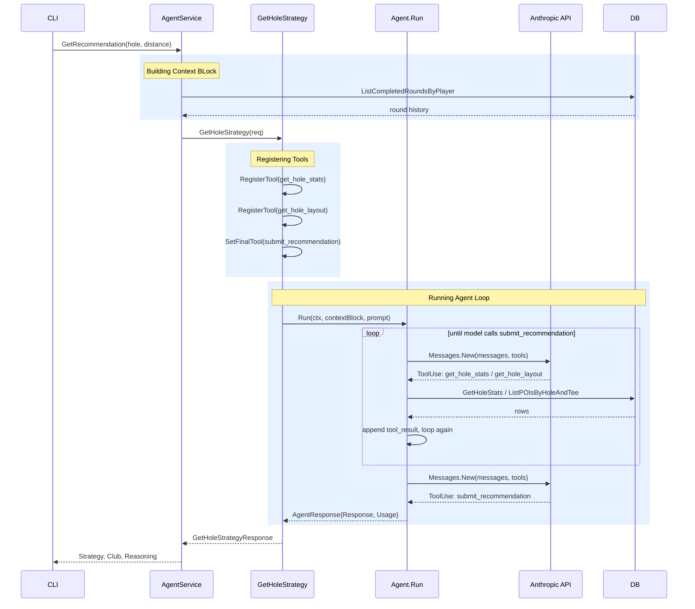

One of the first decisions that I needed to make when starting out with the Agentic Golf Caddy was how to actually interact with the AI model.

I wanted the Agentic Caddy to be callable for a shot at any point on the course - describe the situation, leverage the data we have on the player, the course and the hole and provide a recommendation based on the situation, historical performance and trends.

All of this data is critical context that the Caddy needs to make its recommendation.

But how much information should be provided? Is it always needed or should the agent _decide_ when to get it?

Once we've landed on an approach there, how timely should this information be?  Should we persist a session for the whole round or just within the context of a single request?

These decisions are somewhat simple on their own when thinking in traditional application architectural patterns, however they pose a unique challenge for Agentic Systems when you need to deal with Context Windows.

## What is the Context Window

If you read the [first post]() in this series, all the interactions that you have with an Large Language Model is just sending structured text over the wire.

In a sense, you can think of every message that you send to Claude or ChatGPT as the first time the LLM has received a message from you. 

It's a one shot approach - send a message and get a response.

If you need to provide more information or a history of the conversation - say for a follow up question, then you send all previous messages over the wire so the model can reason over inputs and outputs and generate you an appropriate response.

This works up until the moment model hits a limit on the number of tokens that can be processed in context and hits the limit of its Context Window.  

Thats where compaction, summarisation and off-loading to cold storage happens and the concepts of context shift toward memory management.

It's important to understand this once we start talking about the application itself, as the size of the context that is continually passed back and forth, and how quickly this can grow, directly relates to not only the cost of your API calls but also critically, the latency of the responses.

## The Application as an AI Harness

[Harness Engineering](https://www.anthropic.com/engineering/harness-design-long-running-apps) is another hot topic within the world of agentic system design.

You can think of a harness as any application (either web, thick or command-line-interface) which you use to interact with an agentic system - so think of your Claude Code, ChatGPT mac application or the Google Gemini functionality built into Search as different forms of harnesses providing differing capabilities.

While each of those harnesses are fundamentally different, they generally provide a similar set of capabilities:
- Identity & Access Management - API access, permissions, etc
- Input Controls - Human and System interaction
- Memory Management - Initial load and management of the context window
- Session Management - Persistence 
- Tooling Capabilities - extensibility points
- Guardrails and Policy - content filters, budget limits, approvals, etc
- Observability - logging and monitoring, traceability
- Error Handling and Retry Logic

When designing how the Agentic Golf Caddy was going to function and interact with the LLM, we needed to consider all of these in isolation and how they work together and this gives a picture of our application architecture detailed enough for this article:

| Capability | Decision Point |
| --- | --- |
| Identity & Access Management | Not implemented yet... | 
| Input Controls | Access to the Agent channeled through a local go AgentService.  Human input provided through a simple, text based TUI for now.  | 
| Memory Management | Golfer records their rounds and shots into a local SQLite database which the AgentService queries to build the context - providing the course, handicap, clubs available, distances, etc straight to the model. | 
| Session Management | The harness allows the golfer to play a full or partial round as well as resume a round that's in progress.  Each request for advice however is completely standalone with no long-running session maintained outside what is achieved through context management. | 
| Tooling Capabilities | Two tools are made available for the first version - get_hole_layout to describe the current hole's layout and hazards and get_hole_stats which returns the players historical performance on a specific hole.  The tools are made available and the agent decides if the tool is needed which the harness is responsible for running and providing the results back to the model. | 
| Guardrails and Policy | None. | 
| Observability | Logging and tracing implemented throughout - both in terms of traditional application logging but also Anthropic SDK telemetry to capture usage metrics and telemetry data. | 
| Error Handling and Retry Logic | Nothing specific yet outside standard Golang error handling practices. | 

Building the application to these capabilities gave us a solid baseline to start from, but once we had a working harness where we could simulate playing a few holes and getting caddy recommendations, it became clear from the telemetry and log files that something was a little off.

## Tooling and The Trap of Agency

Every request for advice was taking around 5 seconds and while the token usage didn't seem crazy at the time (~8000 input tokens per request), I was noticing that every call to the agent was making multiple round-trips and it was all to do with the tools.

The decision to expose these capabilities as tools was intentional - agentic systems should have _agency_ and be empowered to decide what information is needed to be pulled in - so in theory this makes sense.  However, where we run into problems is situations like this where the tools absolutely must be called for the agent to be able to do its thing.

Then it's just inefficient - as you can see in the diagram below every call to the Anthropic API for a tool call sends not just the results of the tool execution, but also, all previous messages sent.  In an application of this size, it's not a huge problem but still highly inefficient.

At this stage, this was really a hypothesis - to be honest I didn't really know how much this was affecting the system?

Was it really something that should be fixed? If we could fix it, what kind of performance improvements could be made? Are the changes worth it?

## Baseline the Performance

To test what's going on, I built a small Golang harness that simulated a golfer playing a round and asking for advice on each shot using Anthropic's Haiku 4.5 Model.

The harness was simple and simulated a golfer playing the same 3 holes and asking for 5 shot recommendations - providing a consistent base from which we can assess both the baseline performance as well as any future optimizations we make.

In its baseline configuration, the harness was using 37,175 input tokens and producing 1755 output tokens - taking ~30s in total time and costing just under 5c - so just under a cent per recommendation.

| Date | Model | Input | Output | Time | Cost
| --- | --- | --- | --- | --- | --- 
| Baseline | Haiku 4.5 | 37175 | 1755 | 29.8s | 4.6c 

What became noticeable is that every request was making 2 calls to the API __consistently__ - the first to send the system prompt, context block and the user prompt, receive a response calling for the data from the two tools, and then a subsequent request that sent back all the previous information as well as the JSON data provided by the tools.

## Reduce the Tool Overhead

We clearly still needed the data that the tool calls provides - hole features and historical performance are critical to the agent executing its role.

However it's the consistency of the calls that led me to consider the impact - if the model is always requesting the data, we should eliminate the round trip.

Our first step was to unwire the tool calls from the agent and restructure our [MarkDown Context Block](https://gist.github.com/sbedford/c73ed2ed609e5536fe855dc4bade4503) to include the tool outputs.

| Date | Model | Input | Output | Time | Cost
| --- | --- | --- | --- | --- | --- 
| Baseline      | Haiku 4.5 | 37175 | 1755 | 29.8s | 4.6c 
| Tool Removal  | Haiku 4.5 | 18534 | 1110 | 18.8 | 2.4c 
| --- | --- | --- | --- | --- | --- 
| __Savings__ | __Haiku 4.5__ | __18641__ | __645__ | __11s__ | __2.2c__ 

This improvement had a significant impact! 

We reduced the cost per call by almost 50% and improved the latency of the calls by 37% which is obviously a significant improvement.  

## Learnings

This process of measurement and discovery pushed me to more deeply understand concepts that I had a superficial understanding of.  It's easy to be a user of Claude or any other AI harness and talk about things like Prompt Engineering, Context Management or Harness Engineering and sound like you know what you're talking about.

But the reality is that until you dig under the covers and put it in the space of a real-world application it's an academic exercise. 

Everything is a trade-off - every decision that was discussed here had an impact in terms of what the application could do, how the user experienced the services and ultimately the cost of running the system.

There are many levers available to tune agentic systems - here we're discussing one of those in tuning the context and tooling processes.  I also explored using [Prompt Caching](https://platform.claude.com/docs/en/build-with-claude/prompt-caching) but at this context size and the way our application behaves, the cache-write overhead outweighed any savings from cache reads. That's a trade-off worth revisiting once the game model context grows in later stages and worth a post all on its own.

In the [first post]() in this series I spoke about whether an application was truly "Agentic" or simply Generative.  This is another example where we're removing a capability from the agent which would be classified more on the agentic side of the ledger, but in reality we're achieving the same (arguably better) results with a big improvement to both cost and latency and at the end of the day thats more important than any particular label.

When designing agentic systems, thinking through clearly what the agent needs, when it needs it and how it should be made available is critical.  We understand now the way that agentic loops work and the impact that has on context (and ultimately cost and latency) so we can make better informed decisions and ultimately build better systems.